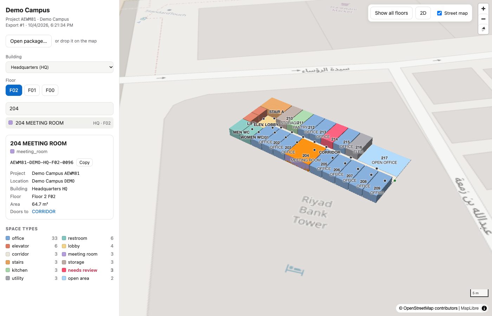
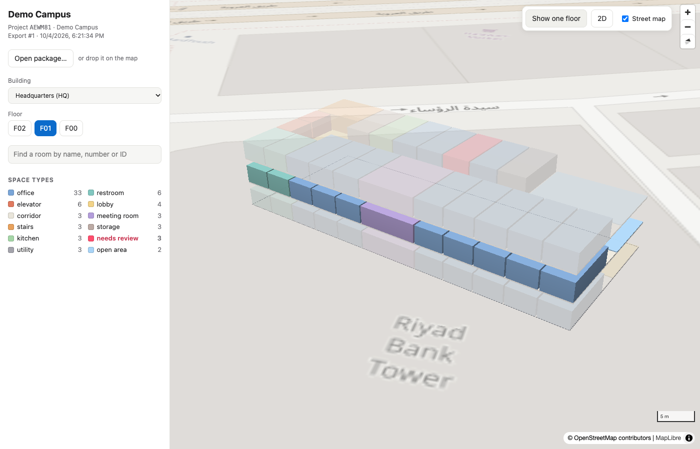

# StoreyPath

Turn DWG/DXF floor plans into **portable indoor maps** that any system can use:
show buildings in 3D floor by floor, find an office, show where people sit, guide
new employees around.

| Find a room, see its full ID and where it is | All floors of a building |
|---|---|
|  |  |

## How it fits together

```
DWG / DXF ──▶ StoreyPath Studio ──▶ package (*.storeypath) ──▶ StoreyPath Viewer (in your web app)
               convert · review · fix · export                └─▶ any other system: import objects.csv,
                                                                     map our IDs to its own
```

| Folder | What it is |
|---|---|
| [studio/](studio) | **StoreyPath Studio** (Python): converts drawings, keeps IDs stable across revisions, lets you correct the result, exports packages |
| [viewer/](viewer) | **StoreyPath Viewer** (JavaScript): read-only 3D viewer engine to embed in web apps |
| [spec/](spec) | **The package format**: [FORMAT.md](spec/FORMAT.md) and JSON Schemas — everything a system needs to read a package without our code |

## Stable IDs

Every object gets a hierarchical ID that says exactly where it is, and that stays
the same when revised drawings are imported again:

```
PROJECT-LOCATION-BUILDING-FLOOR-OBJECT        K7Q2XM-RUH-HQ-F02-0142
```

Systems store our ID as the key of their own mapping (to employees, desks,
bookings…). Each export carries a list of IDs added, changed and retired since
the previous one, and a retired ID is never issued again.

## Try it

Requires Python 3.12+ and [uv](https://docs.astral.sh/uv/).

```sh
cd studio
uv sync
uv run storeypath demo demo/
uv run storeypath view demo/demo.storeypath
```

## Status

| # | Milestone | State |
|---|---|---|
| 1 | Format v0, IDs, workspace, schemas, validator | done |
| 2 | One floor from a DXF with room outlines → package → viewer | done |
| 3 | Spaces from walls when there are no room outlines; review editor in Studio | next |
| 4 | Several floors and buildings aligned; control-point placement | partly (placement by anchor + bearing) |
| 5 | Navigation graph and routing | |
| 6 | DWG and real-world samples | DWG reading wired, untested on real files |
| 7 | Hardening: change reports, docs, releases | change list done |

## License

[Apache License 2.0](LICENSE).
