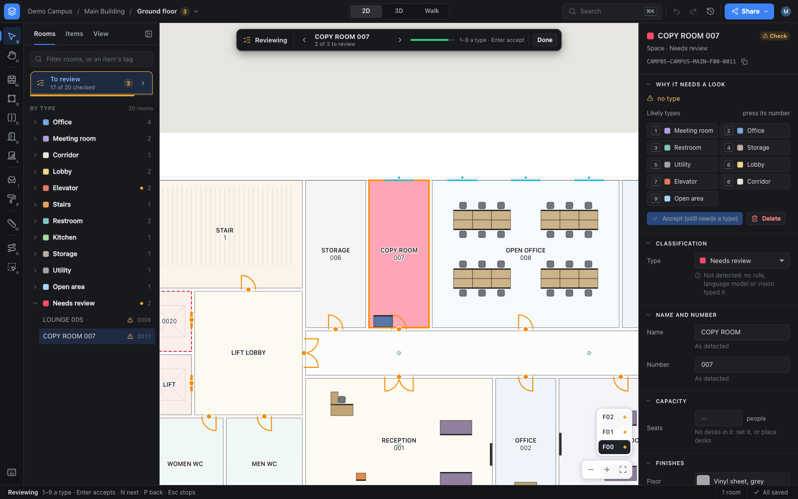
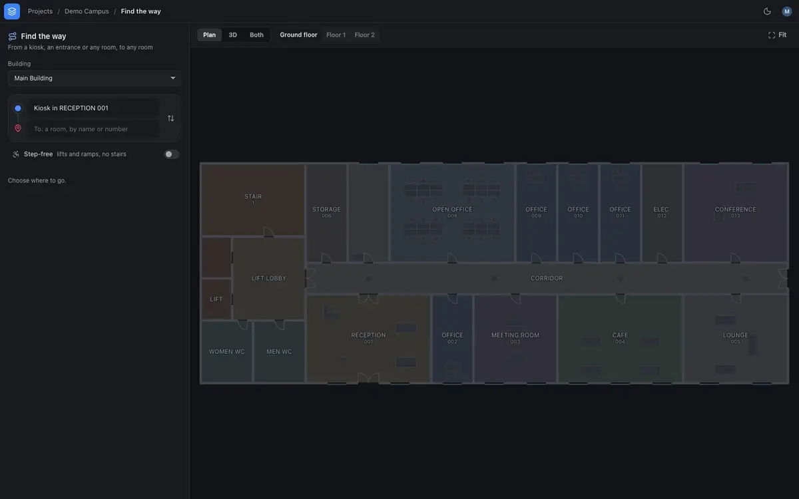
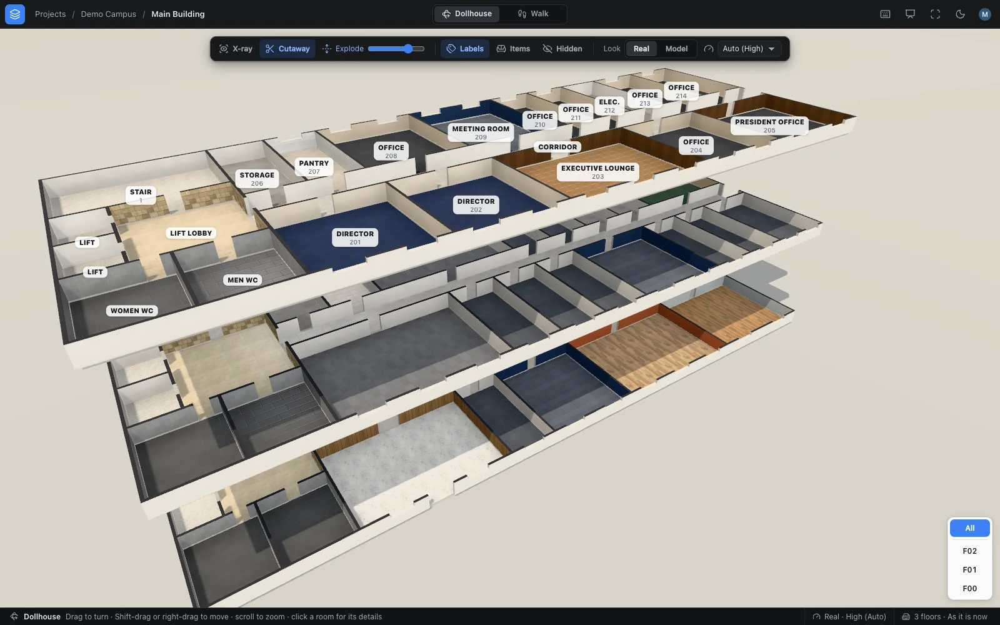
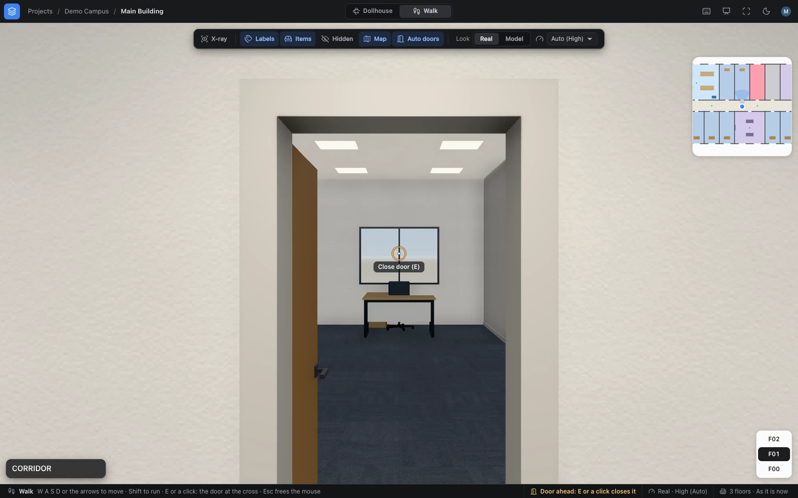

# Using Studio

A tour of StoreyPath Studio, page by page: what each part does, and its keys. The
[README](../README.md) shows it in pictures; [How Studio reads a
drawing](HOW-STUDIO-READS-A-DRAWING.md) says how a drawing becomes floors and rooms.

- [What you can do in Studio](#what-you-can-do-in-studio): [projects](#projects-locations-and-buildings),
  [drawings](#adding-drawings), [the site plan](#the-site-plan),
  [Review](#review-correct-complete-check), [furniture and equipment](#furniture-and-equipment),
  [finishes](#finishes), [capacity](#capacity-and-grade), [export](#export-one-building-per-package),
  [another Studio](#sending-a-project-to-another-studio), [the viewers](#the-viewers)
- [Navigation: from the kiosk to your office](#navigation-from-the-kiosk-to-your-office)
- [3D: the dollhouse, walking, and the 3D page](#3d-the-dollhouse-walking-and-the-3d-page)

## What you can do in Studio

Studio is a web app: everything below is in the browser, and runs on the machine it
is served from.

### Projects, locations and buildings

A **project** holds one site or campus: its drawings and every ID ever issued for
it. Create one by name on the Projects page; Studio gives it a code that never
changes (`K7Q2XM`). Inside it are **locations** (sites, campuses) and their
**buildings**, made as you add floors: each plan you add goes to a location and
building the project has, or to a new one you name. *Delete project* removes a
project and everything in it, once you type its name.

### Adding drawings

- **Drop DWG or DXF files** on the project. With *Remove private information*
  ticked (the default), Studio first finds the title blocks (client, owner,
  consultant, who drew it, stamps), names, phone numbers, emails, permit and plot
  numbers, images and the file's hidden data, and shows them: untick anything to
  keep, then only the cleaned copy is kept, as `drawing-1.dxf`; the file you sent,
  and its name, are not. **Words**, beside each drawing, lists every word left in
  it.
- **Find plans** lists every drawing on the sheets with its title, size and a
  thumbnail. Tick the ones that are floors and say, for each, its location,
  building, floor number (0 ground, -1 a basement), name, height and parapet:
  Studio fills them in from the titles and the sections. Several plans on one sheet,
  one file per floor, an outbuilding on the same sheet: all work.
- **Units.** If Studio is not sure of the units it says so; choose them from the
  list and the plans are found again.
- **Add the chosen plans as floors**: Studio lines each building's floors up, reads
  them, and puts a new building that would stand on top of another beside it on
  the site plan. A plan on a floor that a building has already can **replace its
  drawing**: its rooms keep their IDs.
- The project page shows, per floor, the drawing and plan it came from and *How it
  was read* (what each layer was taken to hold). *Read* reads a floor again whose
  reading failed.

### The site plan

Each location has a **site plan**: its buildings drawn from above, where they stand
relative to each other. Drag a building to move it, or its round handle to turn it
(<kbd>Shift</kbd>: by 15°); with a building chosen, the arrows move it 1 m
(<kbd>Shift</kbd>: 10 m) and <kbd>[</kbd> <kbd>]</kbd> turn it 1° (<kbd>Shift</kbd>:
15°), or type its x, y and turn. *Side by side* lines them up 10 m apart.

**Place on the map** puts the whole site on the earth: the latitude and longitude of
its centre and the compass bearing of up. Every building goes with it. A building
can also be placed on the map by itself, which then wins over the site plan. Until
then buildings are exported around 0°N 0°E with their true shapes and sizes, marked
not placed. Moving or turning a building, on the site plan or the map, changes
nothing in it: its rooms, doors and items keep their IDs and their places in the
building.

### Review: correct, complete, check

*Review* on a floor opens the review editor: the floor drawn over its drawing, in the
middle; the **tools** on the left (each with its key, shown in its tooltip); the
**navigator** (Rooms, Items, View) beside them; the **inspector** of what is chosen on
the right; a **top bar** that says where you are (project / building / floor: the
floor's name is its menu, with how many rooms each floor has to review) and switches
2D, 3D and Walk; and a **status bar** that says what the tool in use expects, where
the pointer is, what is chosen, who is editing and whether everything is saved. The
building's floors are stacked on the canvas, bottom right, to go from one to another
(<kbd>PgUp</kbd> <kbd>PgDn</kbd>). <kbd>[</kbd> and <kbd>]</kbd> hide and show the
navigator and the inspector, <kbd>\</kbd> both. <kbd>⌘K</kbd> (<kbd>Ctrl K</kbd>)
finds anything: a room by its name, number, type or ID, an item by its tag, a floor,
and every command with its key; <kbd>?</kbd> lists the keys.

- **The drawing** (View): *as printed* (the drawing rendered as on paper, a pixel a
  centimetre), as its *lines*, or *off*. *Side by side* puts the print beside
  Studio's spaces, moving together. Each room is labelled once: as printed, the print
  under Studio's labels is drawn without the drawing's texts, and <kbd>T</kbd> (Studio's
  labels off) shows the drawing's own texts instead, to compare what Studio read with
  what the drawing says. *Open print* (Share) shows the print full size in a new tab.
- **To review** (Rooms) is how many spaces and zones need a look, and why; it starts
  **review mode** (<kbd>N</kbd>): one room after another, brought to the middle of the
  view, the inspector saying why it is flagged and its likely types — <kbd>1</kbd>–<kbd>9</kbd>
  sets one, <kbd>Enter</kbd> accepts it as it is, either goes on to the next;
  <kbd>N</kbd> and <kbd>P</kbd> go forward and back, <kbd>Esc</kbd> stops. Below it
  every room, grouped by type (or by floor finish), with a filter.
- **Click a space** (Select, <kbd>V</kbd>) to see in the inspector its ID (copy it),
  the text written in it on the drawing, why it is listed, and to correct its **type,
  name and number**: each is saved when it is changed, and says what was detected and
  by whom (rules, the language model, vision, a person), with ↺ to go back to it.
  *Accept as it is* checks it without a change; *Use detected* takes your corrections
  away. **Capacity**: how many people it is meant to seat (see below). **Delete**
  (<kbd>Del</kbd>) takes what is not a room (a sliver, the outside) out of the plan,
  the lists and the 3D view; it keeps its ID (and is exported marked `ignored`), and
  *Show deleted* (View) shows it again, to restore. Shift-click (or ⌘-click) adds rooms
  to those chosen, and Shift-drag a band over them: their type and finishes are set
  for all at once.
- **Draw what the drawing leaves out**, with the tools (or right-click the plan:
  what can be done there):

  | Tool | |
  |---|---|
  | *Wall* (<kbd>W</kbd>) | click its two ends; it snaps to walls and parts spaces as a drawn wall does |
  | *Space* (<kbd>R</kbd>) | click its corners (they snap to walls); the first again, a double-click or <kbd>Enter</kbd> closes it, <kbd>Backspace</kbd> takes a corner back. For an area the drawing encloses nowhere, such as a colonnade |
  | *Divide* (<kbd>D</kbd>) | a line right across a space with no wall: it becomes two zones |
  | *Door, window, opening* (<kbd>O</kbd>) | a click on a wall: a door 0.9 m, a window 1.2 m, an opening (a way through, no door) 1.0 m wide, or the width given in its options |
  | *Stairs and lifts* (<kbd>L</kbd>) | stairs, a lift or an escalator: two corners and <kbd>Enter</kbd> for a rectangle, or its outline; added typed, then linked to the floors it serves |
  | *Measure* (<kbd>M</kbd>) | a distance, or an area and its perimeter |

  A door, window or opening chosen shows its **width, sill and height**; *Size as
  drawn* goes back. <kbd>Del</kbd> deletes a door, window or opening of the drawing
  (it can be restored) and takes away what you drew; <kbd>Esc</kbd> gives up what is
  being drawn, then puts the tool down; <kbd>F</kbd> fits the floor in view, Space
  held moves the plan (as the *Pan* tool, <kbd>H</kbd>, does). After each change the
  floor is read again, and what you drew is kept with the floor through every re-read
  and every revised drawing.
- **2D, 3D, Walk — one view** (<kbd>2</kbd>, <kbd>3</kbd>, <kbd>4</kbd>), in the
  same place: the floor, what you chose, the panels and the plan's view stay as they
  are, and switching is instant once the building is built. In 3D the floor stack's
  *All* shows every floor of the building. Walking: click the view to look, <kbd>W A S
  D</kbd> to move, <kbd>Esc</kbd> frees the mouse for the panels; the room you're in
  is shown, and you start in the room you chose, or where the 3D view or the plan was
  looking. In 3D and walking you edit as on the plan: a click chooses a room or an
  item (walking: at the cross) and the inspector shows it; the *Place* tool
  (<kbd>I</kbd>) and *Paint finishes* (<kbd>P</kbd>) work there too; drag items in 3D;
  <kbd>R</kbd>, <kbd>,</kbd> <kbd>.</kbd> and <kbd>Del</kbd> as on the plan. Walls,
  doors, dividers and spaces are drawn on the plan: a drawing tool's key over a place
  in 3D (or right-click, or <kbd>2</kbd>) shows that place there. What changes —
  yours or others' — shows in 3D at once; drawn walls when the floor has been read
  again. *3D window* (the Share menu, or the floor's inspector) opens the building on
  [Studio's 3D page](#3d-the-dollhouse-walking-and-the-3d-page), the whole window.
- **Re-read drawing** (the inspector, with nothing chosen) reads the floor's drawing
  again (a revised one too): IDs and corrections are kept. A reading that would retire
  most of the floor's rooms is held back, the floor unchanged, and Studio asks before
  applying it (*Read anyway*).
- **Share an area** (the *Share an area* tool, <kbd>A</kbd>, or the Share menu; anyone
  who may see the floor): drag a rectangle over a part of the floor Studio read wrong
  (at most 50 × 50 m), write what went wrong, look at the preview and download
  `<id>.spsample`, a small file to send to the StoreyPath team: the drawing in the area,
  the area as drawn and as Studio read it, what Studio decided there and why, and what
  people corrected. People's names, phone numbers, emails, the project's, site's,
  building's and floor's names and codes, Studio's IDs and where the area is are taken
  out; the preview lists every text taken out, each to keep or take out. Nothing is
  sent: the file is downloaded ([Area samples](AREA-SAMPLES.md)). The Share menu
  also exports the building's package and downloads the project's file.

Every change is saved to the project at once. *View* (the navigator) holds how the
floor is shown: the drawing, side by side, labels, colours (by type or by floor
finish), what was deleted, the 3D view's look and quality, and a light or dark
interface.

**Many people at once.** One person edits a floor at a time: the first change takes
it, and everyone else on it sees *Khalid is editing this floor since 10:20: you can
look* with his changes appearing as he saves them (and who made each), until he is
*Done editing* (the status bar), leaves the floor, or leaves it alone for 15 minutes
(an admin may take it over). Review's top bar shows who else is on the floor; a
project's page, who is on which. *Undo* and *Redo* (⌘Z, ⇧⌘Z) take back your own
changes — refused, naming who, when someone else changed the same thing since — and
*History* lists who changed what on the floor, in words
([more](../studio/README.md#many-people-at-once)).

### Furniture and equipment

Desks, photocopiers, access points, sofas, TVs, beds, kiosks: **items** are placed on
the floors in review.

- **The catalogue** of item types is the organization's: one `catalogue.json` in
  Studio's data folder, the same for every project, and copied into every package.
  A new Studio starts with desks by grade (president, C-level, director, manager,
  head of section, senior and junior staff), a central photocopier, a wireless
  access point, a sofa, a TV screen, king- and queen-size beds and a wayfinding
  kiosk, each with a code, English and Arabic names, a size, how it is mounted
  (floor, wall, ceiling) and a colour. Types are added or changed by editing that
  file; a type no longer used is marked `retired`, never removed, so its code stays
  with the items that have it and is never given to another type.
- **Place** one with the *Place* tool (<kbd>I</kbd>): choose its type in the tool's
  options and click where it goes (or right-click, *Place an item here…*). Drag it to
  move it; <kbd>R</kbd> turns it 90°, <kbd>,</kbd> and <kbd>.</kbd> by 15°, the arrows
  move it (Shift: further), <kbd>Del</kbd> deletes it. The inspector changes its type,
  its turn, its floor (carry it to another floor or building) and its details; the
  navigator's *Items* lists the floor's items by type.
- **It stays in its room, and lines up.** An item belongs to the room it was placed
  in (right-clicked or clicked in): dragged, nudged or turned, it stops at that room's
  walls (a zone has no walls: the whole space holds it). Near a wall it turns square to
  it and moves up against it, into a corner too; near another item it lines up with it
  (desks into rows); a TV goes on the nearest wall, its screen into the room. A desk
  counts what is drawn round it (its cabinet goes against the wall, not through it).
  Hold <kbd>Alt</kbd> to place or drag it freely, or into another room.
- **Desks show who they are for.** Each grade's desk has its own size and shade, and
  is drawn (in review, on the plan and in 3D) with what goes with it: a junior's
  plain; a senior's with a return (an L-shaped desk); a head of section's with a
  visitor's chair as well; a manager's with two; a director's and a C-level's with a
  cabinet behind a high-backed chair too; the president's with armchairs for its
  visitors. Only the desk itself is the item: the rest is drawn round it.
- **A kiosk** (type `KIOSK`) is where a wayfinding kiosk stands, its screen at its
  front: wayfinder links each of its kiosks to one, so the kiosk's map shows "you are
  here", and a way to an office can later start from it.
- **An item's ID never changes when it moves**: it is an asset's tag, ten random
  symbols and a check symbol (`7K2Q-XM9F-4DP`), of no place and no project. Carried to
  another office, floor or building, it keeps it; deleted, its ID is never issued
  again. It is written on the asset as it is: a person may type it in either case,
  with or without its hyphens, O for 0 and I or L for 1 (Review's search, <kbd>⌘K</kbd>,
  finds the item, `storeypath item-id` reads it), and the check symbol catches a symbol mistyped
  or two swapped.
- **Who enters what.** Each type's details are fields owned by StoreyPath (what is
  physical: a colour, a size, a model) or by the system that manages the asset (an
  access point's network name or VLAN). Studio shows only its own; the others are
  named and entered in that system, and are never in a package.

This is asset management (where things are, and where they have been), not
inventory: nothing says who holds what.

### Finishes

What each room's floor and walls are finished in: one of StoreyPath's 50 finishes
(carpets, vinyl, porcelain, marble, terrazzo, wood, concrete, rubber, raised floor;
paints, wallpapers, tiles, mosaic, wood slats and panels, stone), or, given none, its
type's (offices carpet, lobbies marble, restrooms porcelain with white wall tiles…).

- **On the plan**, a room's inspector shows its **Floor** and **Walls**: click one for a
  grid of swatches by kind, its type's first. *Apply to every office on this floor* gives
  every room of its type the same, as one change. *Colour: by floor finish* (View) fills
  the plan with the finishes' tones, the legend listing them.
- **In 3D and walking**, *Paint finishes* (<kbd>P</kbd>) shows a palette: choose a floor
  finish and a wall finish, then click a floor (that room's) or a wall (the walls of the
  room on the side you clicked); walking, at the cross. <kbd>Alt</kbd>-click takes up the
  finishes where you click. The room changes at once, in place.

They are corrections like any other: saved at once, in the history, undone and redone,
kept through every re-read, and exported with each space and zone (`floor_finish`,
`wall_finish`, format 0.9).

### Capacity and grade

Each space and zone has a **capacity**, how many people it is meant to seat: the
number set in its panel in review (0: a room meant to seat nobody), else the
workplaces of the desks standing in it (a desk seats one; a space divided into zones
counts its zones'). Its **grade** is who it is laid out for: the highest grade among
its desks. Both go into the package as defaults a system placing people may keep or
replace.

### Export: one building per package

*Export package* writes the package (`.storeypath`, [format 0.9](https://github.com/StoreyPath/storeypath-viewer/blob/main/spec/FORMAT.md)) of
one building, chosen from the list: its floors, spaces, zones, doors, windows and
openings, its items and their catalogue, with every ID, and its walking network
([Navigation](#navigation-from-the-kiosk-to-your-office)). It is checked against the
format before it is kept, downloaded, and listed on the project page (newest first),
with links to view it as a *2D plan*, in *3D*, or as *Rooms by type*.

- Each package lists what was added, changed and retired in its building since that
  building was last exported (`changes.json`), so a system updates its mappings.
- Items carry where they stand in their building (`local`): moving a building on the
  map changes nothing in it, and the change list says only that the building moved.
- Each floor is also built in 3D ahead of time, so a slow machine shows it without
  building it (this takes Node.js, which the Studio image holds).

### Sending a project to another Studio

*Download project* gives one file, `<code>.storeypath-project`: the project with
every correction, edit and ID, its export history, its drawings and the Studio's
item types. Another Studio opens it on its Projects page (*Open a project or a
building's package*) and continues the project where it was (the item types it brings
are added there when an admin, or someone who may change the item types, opens it).
It is not a package: other systems read a building's package.

A building's **package** opens the same way: its building is rebuilt with the same
IDs, into its project when that is here (added, or put in place of that building
once you type the project's name). Its floors have no drawing until one is added;
then they are read again, lined up on the walls they had, and keep their IDs.

### The viewers

- **Walk in 3D** (a project, a building, a floor; an export): Studio's 3D page, the
  project as it is now, no export needed ([below](#3d-the-dollhouse-walking-and-the-3d-page)).
- **2D plan**: each floor as a plain SVG plan, rooms coloured by type, doors with
  their swings, items.
- **Rooms by type**: each room as a block coloured by its type, floors stacked, with
  search: a check of the rooms rather than of the walls.

## Navigation: from the kiosk to your office

A person at a kiosk in the lobby types their employee number and is shown the way to
their office: StoreyPath works out where people can walk in each building, and the
way from any place in it to any other, the same in Studio, in the Go module and in
the viewers, so that a system that guides people (wayfinder) gives the answer Studio
gives.

- **The walking network** goes into every package (`navigation.json`, format 0.8):
  every door and opening, a point in each room and zone, the lifts and stairs on each
  floor, the entrances and the wayfinding kiosks, and the walks between them — across
  each room along the shortest way that keeps off its walls, through its doors, and
  from floor to floor by the lifts and stairs that are one (their *stack*). Plant
  rooms, shafts and voids are not walked; a way through someone's office costs a
  minute more than its time, so the corridor is taken.
- **The way** from a kiosk, an entrance or any room to a room, a zone or a desk: the
  quickest (walking at 1.3 m/s, a lift's wait, 12 s a flight of stairs), or without
  stairs (lifts and ramps alone). It comes as the line to draw on each floor, the
  changes of floor, and short steps ready to show — "Walk 48 m along CORRIDOR to the
  lift", "Take the lift up to Floor 1", "OFFICE 112 is on your left" — each also a
  kind and values, for a system to word in its own language (Arabic).
- **Find the way** in Studio (from a project's buildings, and from Review's *Find the
  way*): choose a start (a kiosk, typed by its tag too, an entrance, any room) and a
  destination, avoid stairs if need be (*Step-free*), and see the way as step cards (the
  turns along each walk, metres and time) beside a calm plan of each floor it crosses,
  drawn in from *You are here*, a badge where it changes floor ("Up to Floor 2": a click
  shows that floor), a pin and a card on the room it ends in. <kbd>↑</kbd> <kbd>↓</kbd>
  go through the steps; **Play** walks a dot along it, floor by floor; **3D** (or
  **Both**) shows it glowing through the building, and **Fly along** takes the camera
  along it, up the stairs or the lift to the destination.

  
- **Stairs and lifts the drawing missed** are drawn in Review with its *Stairs* and
  *Lift* tools, already typed, and added to the other floors they serve in one go;
  each lift's or staircase's floors are linked by their code or where they overlap,
  and a person may link or unlink them by hand.
- **For other systems**: `Package.Navigation()` and `Route(from, to, opts)` in
  [Go](https://github.com/StoreyPath/storeypath-viewer/tree/main/go), `route(pkg, from, to, { accessible })` in the [viewers](https://github.com/StoreyPath/storeypath-viewer/tree/main/viewer), with
  `showRoute(route)` on the 2D plan and in the 3D world;
  [spec/conformance/routes.json](https://github.com/StoreyPath/storeypath-viewer/tree/main/spec/conformance) holds ways every reader must find
  the same.

## 3D: the dollhouse, walking, and the 3D page

Every building opens as a 3D world, straight from Studio, with nothing downloaded:
the walls at the thickness they were drawn, with skirting, parapets around roofs
and terraces, doorways you walk through, doors with architraves and handles that
open and shut, windows with sills, boards and glass, furniture with its chairs,
floors and walls finished as each room is (its own finishes, or its type's: carpet
tiles in offices, marble in lobbies, porcelain in corridors, restrooms and kitchens,
terrazzo on stairs, oak in homes), under a sun that casts soft shadows, with ambient
occlusion where surfaces meet. Two looks, one click apart: **Real** (the default) or
**Model**, white like an architect's model with its edges drawn; and **Quality**
Auto (Low on integrated, virtual or software graphics), High or Low.

- **Dollhouse.** Orbit the building, pick a floor, cut the walls down to see the
  plan in 3D, lift the floors apart, or switch on x-ray: see-through walls and every
  room a translucent volume tinted by its type. Click a room for its ID, area,
  finishes and the rooms its doors lead to. Furniture and equipment show when one
  floor does.
- **Walk.** Start at the front door and walk in: mouse to look, <kbd>W A S D</kbd> to
  move, <kbd>Shift</kbd> to run. Walls and windows stop you, and so does a shut door
  until it opens: walking into it opens it, or <kbd>E</kbd> or a click at it opens or
  shuts it (*Auto doors* off: only those). The name of the room you're in shows as you
  enter it, a map follows you, and at stairs or a lift <kbd>E</kbd> and <kbd>Q</kbd>
  (or <kbd>PgUp</kbd>, <kbd>PgDn</kbd>) take you up and down.

**Studio's 3D page** (`world.html`: *Walk in 3D* on a project's page, a building's or
an export's *3D*, Review's *3D window*) shows a building the whole window, read only:
Studio's top bar (where you are; Dollhouse <kbd>3</kbd> or Walk <kbd>4</kbd>), a
toolbar over the world (X-ray <kbd>X</kbd>, Cutaway <kbd>C</kbd>, Explode, Labels
<kbd>L</kbd>, Items <kbd>I</kbd>, Hidden; walking, the map <kbd>M</kbd> and Auto
doors; Look and Quality), the floor stack with *All* (<kbd>PgUp</kbd>,
<kbd>PgDn</kbd>), a room's or an item's details (with *Walk here* and a way to it in
Review), and a slim status bar that says what the view expects and, walking, the door
at the cross. <kbd>F</kbd> is full screen, <kbd>?</kbd> lists the keys, and
<kbd>P</kbd> **presents**: nothing but the building, for a big screen, turning slowly
in the dollhouse (<kbd>T</kbd> stops it), <kbd>Esc</kbd> back. What it shows is kept
in its address, so a link or a reload shows the same.

| The dollhouse: every floor, lifted apart and cut away | Walking: the door at the cross, the map, the room you are in |
|---|---|
|  |  |

The 3D world always shows the project as it is now, no export needed. It's
[three.js](https://threejs.org) (WebGL), drawn from the package alone, so it works the
same embedded in your own app ([viewer/](https://github.com/StoreyPath/storeypath-viewer/tree/main/viewer)).

